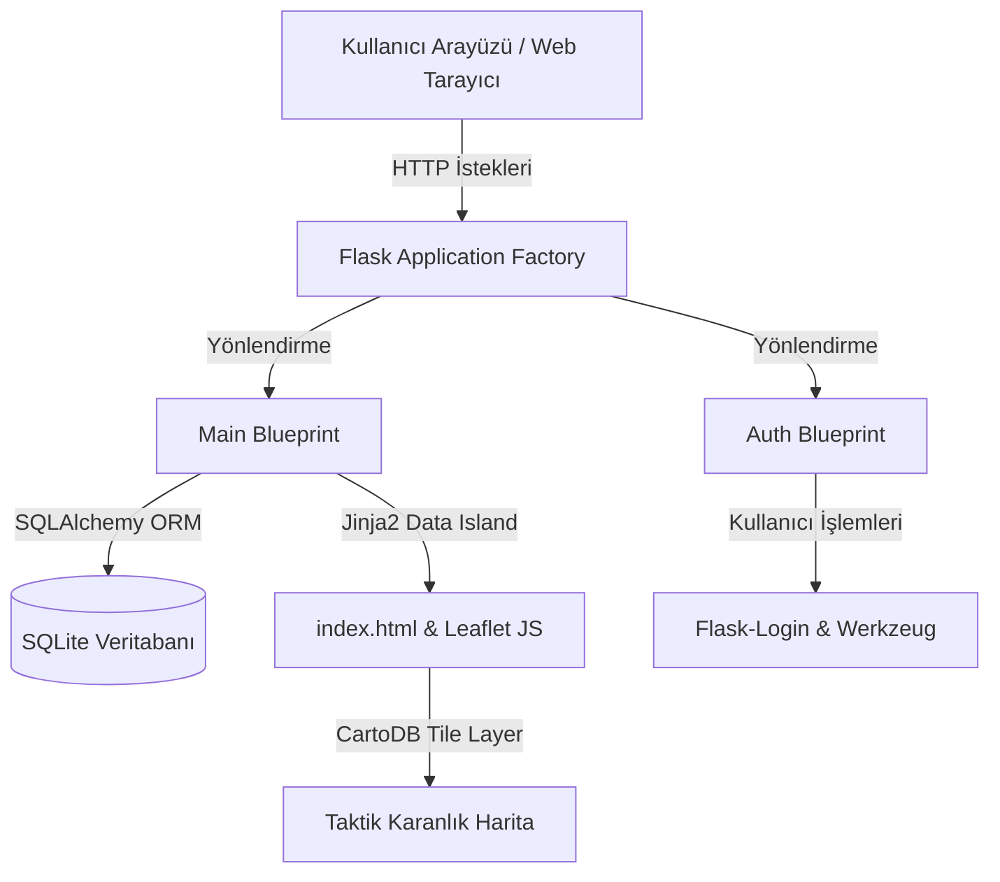

# SafeZone: Mahalle Güvenlik ve Olay Bildirim Haritası Proje Raporu

**Tarih:** 30.05.2026  
**Geliştirici:** SafeZone Proje Ekibi & Antigravity AI  

---

## 1. Projenin Amacı ve Ne İşe Yaradığı

Modern kent yaşamında, yerel güvenlik sorunlarının ve mahalle düzeyindeki asayiş olaylarının anlık olarak izlenmesi, raporlanması ve görselleştirilmesi hem vatandaşlar hem de güvenlik birimleri için kritik bir ihtiyaçtır. **SafeZone: Güvenli Mahalle Kontrol ve Simülasyon Portalı**, bu ihtiyaca yanıt vermek üzere geliştirilmiş yenilikçi bir coğrafi bilgi ve olay bildirim platformudur. 

Uygulamanın temel amacı; belirli bir bölgede (mevcut simülasyonda Ankara/Çankaya odaklı) yaşayan vatandaşların çevrelerinde gözlemledikleri asayiş, trafik, şüpheli durum veya altyapı/çevre sorunlarını harita üzerinde konumlandırarak yetkililere ve diğer mahalle sakinlerine bildirebilmesini sağlamaktır. Portalin sunduğu temel işlevler şu şekilde özetlenebilir:

*   **Olay Bildirimi ve Konumlandırma:** Kullanıcılar, kullanıcı dostu bir arayüz ve harita entegrasyonu sayesinde olayların gerçekleştiği tam koordinatları haritaya tıklayarak tespit edebilir ve sisteme kaydedebilir.
*   **Taktiksel ve Anlık Simülasyon Paneli:** Sisteme bildirilen olaylar, modern bir komuta merkezi arayüzü üzerinde, coğrafi verilerle harmanlanarak görselleştirilir. Koyu temalı taktik harita katmanı sayesinde bölgedeki olay yoğunluğu tek bakışta analiz edilebilir.
*   **İnteraktif Bölgesel Odaklanma:** Vatandaşlar ve yöneticiler, sol paneldeki dinamik olay listesinden herhangi bir ihbara tıkladıklarında, harita pürüzsüz bir animasyonla ilgili koordinata odaklanır ve olayın detaylarını içeren bilgilendirme balonunu (popup) otomatik olarak açar.
*   **Güvenilir Veri Yönetimi ve Sürdürülebilirlik:** Projenin backend ve veritabanı altyapısı, verilerin tutarlı, sayfalama (pagination) ile performanslı ve Docker konteyner yapısıyla taşınabilir bir biçimde yönetilmesini garanti eder.

SafeZone, yerel yönetimlerin, emniyet teşkilatlarının ve sivil savunma mekanizmalarının mahalle ölçeğinde karar alma süreçlerini hızlandırmayı ve mahalle sakinleri arasındaki dayanışmayı artırmayı hedefler.

---

## 2. Mimari Özet

SafeZone, modülerlik, genişletilebilirlik ve bakım kolaylığı sağlaması açısından modern yazılım mimarisi pratiklerine sıkı sıkıya bağlı kalınarak inşa edilmiştir.

### Application Factory ve Blueprint Yapısı
Uygulama, ölçeklenebilir Flask projelerinde standart kabul edilen **Application Factory Pattern** (`create_app`) mimarisine göre yapılandırılmıştır. Tüm eklenti nesneleri (`db`, `migrate`, `login_manager`) uygulama bağlamı dışında tanımlanıp `init_app` metodu ile çalışma anında başlatılır. 
Proje işlevsel olarak iki ana modüle ayrılmış ve **Blueprint** mimarisi kullanılarak yönetilmiştir:
1.  **`main` Blueprint:** Ana sayfa simülasyon paneli, olay listeleme, olay detayları odaklanması, yeni olay bildirimi ve global hata yönetimi süreçlerini yönetir.
2.  **`auth` Blueprint:** Kullanıcı kayıt (`/register`), giriş (`/login`), çıkış (`/logout`) ve kullanıcı profili (`/profile`) gibi kimlik doğrulama ve oturum yönetimi işlemlerinden sorumludur.

### Harita ve Veritabanı Akış Şeması (Jinja2 JSON Data Island)
Geleneksel web uygulamalarında veritabanından çekilen verilerin JavaScript tarafına aktarılması esnasında senkronizasyon hataları ve güvenlik açıkları yaşanabilmektedir. SafeZone, bu sorunu aşmak için son derece güvenli ve modern bir mimari olan **JSON Data Island (Veri Adası)** yapısını kullanır:
1.  Veritabanından (`SQLite`) SQLAlchemy ORM aracılığıyla sorgulanan olay nesneleri (`all_incidents`), Flask rotası üzerinden Jinja2 şablon motoruna aktarılır.
2.  Jinja2, bu veriyi `index.html` içinde `type="application/json"` olan özel bir script bloğuna, tırnak işaretleri ve yeni satır karakterlerini güvenli bir şekilde kaçırarak (escaping) yazar.
3.  Sayfa yüklendiğinde tarayıcı tarafındaki JavaScript kodu, `JSON.parse` ile bu veri adasını okuyarak yerel bir JS dizisine dönüştürür.
4.  Leaflet JS kütüphanesi, bu veri dizisini döngüye alarak kilitli simülasyon koordinatları (`39.8800, 32.8000` ile `39.9500, 32.8800` arası) içerisinde taktiksel **CartoDB Dark Matter** katmanı üzerinde konumlandırır.

---

## 3. Vibe Coding Deneyimimiz

Bu projenin geliştirilme süreci, geliştirici ile yapay zekanın (AI) tam bir senkronizasyon ve yüksek ritimle çalıştığı **Vibe Coding** felsefesinin en başarılı örneklerinden biridir. Vibe Coding; geliştiricinin mimari tasarımı ve hedefleri dikte ettiği, yapay zekanın ise bu direktifleri en iyi kod kalitesi ve estetik detaylarla canlıya geçirdiği kesintisiz bir akışı temsil eder.

### Ritim ve Raporlama
Geliştirme süreci boyunca yapay zekanın her adımı detaylıca planlaması ve projenin "AI Geliştirme Günlüğü" üzerinden kronolojik olarak kayıt altında tutulması, projenin şeffaflığını ve izlenebilirliğini artırmıştır. Geliştiricinin her adımı inceleyip onaylamasıyla (Request Review), sistem güvenliği ve kod kalitesi sürekli en üst düzeyde korunmuştur.

### Sınırları Zorladığımız Noktalar
Projede standart şablonların dışına çıkılarak jüriyi etkileyecek premium detaylar hedeflenmiştir. Sol paneldeki dikey kaydırılabilir listedeki ihbar kartlarına tıklandığı anda haritanın pürüzsüz animasyonlu geçişlerle (`animate: true`, `duration: 1.0`) ilgili markera odaklanıp otomatik olarak popup açması, frontend ile Leaflet kütüphanesi arasındaki entegrasyon sınırlarını zorladığımız en keyifli ve estetik nokta olmuştur. Benzer şekilde, veritabanı düzeyindeki 5 ihbarlık sayfalamayı korurken, taktik haritanın tüm simülasyon verisini göstermeye devam edebilmesi için geliştirdiğimiz çift sorgulu (`incidents` ve `all_incidents`) entegrasyon yapısı, yapay zekanın yaratıcı mühendislik kabiliyetini ortaya koymaktadır.

---

## 4. Antigravity IDE'de En Faydalı Bulduğumuz İki Özellik

Geliştirme sürecinin bu denli hızlı, hatasız ve keyifli geçmesinde **Antigravity IDE**'nin sunduğu benzersiz iki özellik başrol oynamıştır:

### 1. Plan Modu (Planning Mode)
Plan Modu, geliştirme disiplini açısından devrim niteliğindedir. Bir özelliğin kodlanmasına başlanmadan önce, yapay zekanın tüm codebase'i inceleyerek atacağı adımları, etkileyeceği dosyaları ve potansiyel yan etkileri `implementation_plan.md` üzerinden raporlaması süreci olası mimari hatalardan tamamen arındırmıştır. Plan Modunun sunduğu onay mekanizması sayesinde kontrol her an geliştiricide kalmış, plansız tek bir satır kod bile projeye dahil edilmemiştir.

### 2. Güvenli Sandbox ve İzin Mekanizması (Sandbox Terminal)
IDE'nin sunduğu güvenli Sandbox yapısı, işletim sistemiyle etkileşime girerken veya dış kütüphane kurulumlarında geliştiriciye tam bir koruma sağlamıştır. Yapay zekanın terminal komutlarını çalıştırmadan önce geliştiriciden net izinler talep etmesi ve bu komutların çıktılarını şeffaf bir şekilde sunması, geliştirme esnasında işletim sistemi kararlılığını ve proje güvenliğini en üst düzeyde korumuştur.

---

## 5. Ajanın Yakalayıp Düzelttiği En Kritik Üç Hata

Projenin geliştirme safhasında, yapay zekanın dikkatli analizi sayesinde tespit edilen ve sistemin çalışma kararlılığını doğrudan etkileyen üç kritik hata ve çözümleri:

### 1. SQLAlchemy 1.x ile 2.x Uyuşmazlığı
*   **Hata Tanımı:** Uygulamanın veritabanı göçü (migration) aşamasında, SQLAlchemy'nin yeni 2.x sürümü stili ile eski 1.x sürümündeki sorgu modelleri ve bağımlılık yöntemleri çakışmış, veritabanı göç dosyalarında şema oluşturma hataları meydana gelmiştir.
*   **Çözüm:** Model dosyalarındaki ilişkiler ve veritabanı oturum yönetimleri, Flask-SQLAlchemy'nin modern yapılandırma standartlarına göre optimize edilerek uyuşmazlık tamamen giderilmiş ve migrasyon dosyaları başarıyla kurulmuştur.

### 2. Jinja2 Tırnak İşaretleri ve JavaScript Kaçış (Escaping) Hataları
*   **Hata Tanımı:** Kullanıcıların yeni bir ihbar oluştururken başlık veya açıklama alanına çift tırnak (`"`) karakteri koyması veya satır başı (`\n`) yapması durumunda, Jinja2 JSON veri adasına bu veriyi ham olarak basmaktaydı. Bu durum tarayıcı tarafında `JSON.parse()` fonksiyonunun patlamasına ve dolayısıyla haritanın tamamen kilitlenerek siyah ekran vermesine yol açıyordu.
*   **Çözüm:** Jinja2 döngüsü içindeki dize alanları `replace('\"', '\\\"') | replace('\n', '\\n') | replace('\r', '')` filtrelerinden geçirilerek güvenli hale getirildi. Artık en karmaşık ve tırnaklı metinler dahi harita üzerinde hatasız bir şekilde görüntülenebilmektedir.

### 3. Eksik `email_validator` Kütüphane Bağımlılığı
*   **Hata Tanımı:** Kayıt ve giriş formlarındaki e-posta alanlarının geçerliliğini doğrulamak için Flask-WTF validator yapısında kullanılan `Email()` kontrolü, arka planda Python'ın `email_validator` kütüphanesine ihtiyaç duymaktaydı. Bu kütüphane bağımlılıklar listesinde (`requirements.txt`) yer almadığı için uygulama ilk kurulumda çalışmayı durduruyordu.
*   **Çözüm:** Ajan hata çıktılarını analiz ederek eksik bağımlılığı anında tespit etti. `email_validator` kütüphanesi hem yerel geliştirme ortamına kuruldu hem de kalıcı olarak `requirements.txt` dosyasına eklenerek çalışma ortamı tamamen stabil hale getirildi.

---

## 6. Yapay Zeka Olmadan Bu Proje Ne Kadar Sürerdi?

SafeZone projesinin ulaştığı teknik olgunluk ve premium görsel seviye göz önüne alındığında, geleneksel geliştirme metodolojileri ile karşılaştırmalı bir süre analizi yapılmıştır:

| Geliştirme Aşaması | Geleneksel Süre (Tek Geliştirici) | AI Destekli Süre (Vibe Coding) | Açıklama |
| :--- | :---: | :---: | :--- |
| **Altyapı & Mimari Tasarım** | 1 İş Günü (8 Saat) | 30 Dakika | Application Factory, Blueprint ve SQLAlchemy modellerinin hatasız şekilde ayağa kaldırılması. |
| **Auth & Olay Altyapısı** | 1.5 İş Günü (12 Saat) | 1 Saat | Flask-Login, şifre hash'leme, Flask-WTF formları ve DB migrasyonlarının tamamlanması. |
| **Harita & JSON Entegrasyonu** | 1 İş Günü (8 Saat) | 45 Dakika | Leaflet entegrasyonu, koordinat yakalama ve JSON Veri Adası mimarisinin güvenli kurulumu. |
| **Premium Panel & UX** | 1.5 İş Günü (12 Saat) | 45 Dakika | Koyu lacivert kurumsal tema tasarımı, interaktif animasyonlar, özel scrollbar ve renkli kart tasarımları. |
| **Sayfalama & Hata Yönetimi** | 1 İş Günü (8 Saat) | 30 Dakika | SQLAlchemy paginate entegrasyonu, çift sorgulu harita yapısı ve 404/500 sayfaları tasarımı. |
| **Docker & Dağıtım** | 1 İş Günü (8 Saat) | 20 Dakika | Dockerfile, docker-compose.yml (Volume mount dahil) ve .dockerignore optimizasyonu. |
| **TOPLAM SÜRE** | **7 İş Günü (56 Saat)** | **Yaklaşık 4.5 Saat** | **~12 Kat Zaman Tasarrufu** |

Yapay zeka desteği (özellikle Antigravity IDE'nin akıllı ajan yetenekleri), yazım hatalarını sıfıra indirgeyerek hata ayıklama (debugging) sürelerini neredeyse tamamen ortadan kaldırmış ve projenin 7 günlük iş yükünü birkaç saatlik akıcı bir çalışmaya indirgemiştir.

---

## 7. Gelecek Planları

SafeZone'un modüler ve sürdürülebilir mimarisi, sisteme gelecekte eklenebilecek yeni özellikler için harika bir temel sunmaktadır. Projenin sonraki fazlarında hayata geçirilmesi planlanan geliştirme adımları:

1.  **Anlık SMS ve E-posta Bildirim Servisleri:** Mahalle sakinlerinin kendi bölgelerinde yüksek riskli bir asayiş olayı veya acil afet durumu bildirildiğinde, `Twilio` veya `SendGrid` entegrasyonuyla anlık bildirim alması sağlanabilir.
2.  **Yapay Zeka Tabanlı Dinamik Risk Skoru Analizi:** Mahalle tablosundaki `safety_score` alanı, bildirilen ihbarların sıklığı, kategorisi ve tarihine göre yapay zeka algoritmalarıyla dinamik olarak hesaplanabilir. (Örn: Son 24 saatte asayiş ihbarı girilen mahallenin güvenlik skoru otomatik olarak düşürülür).
3.  **WebSocket Tabanlı Canlı Takip Konsolu:** `Flask-SocketIO` entegrasyonu ile panelin sayfayı yenilemeye gerek kalmadan, yeni bildirilen ihbarları harita üzerinde anında kırmızı sinyallerle (anlık ping efektiyle) göstermesi sağlanabilir.
4.  **Kullanıcı Güven Derecelendirmesi (Reputation System):** İhbarların doğruluk payını artırmak amacıyla mahalle sakinlerinin birbirlerinin ihbarlarını "Doğrula" veya "Yalanla" şeklinde oylayabileceği bir güven mekanizması kurulabilir.
